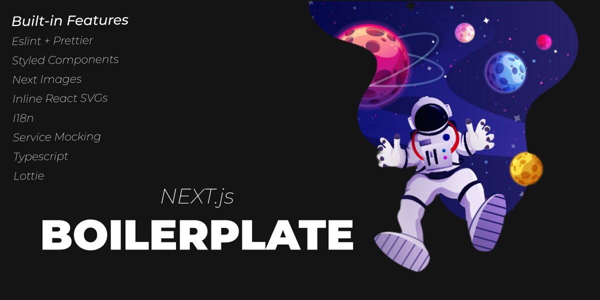

 
 

  

  

    Basic Next.js boilerplate ready to use in any type of websites.
     
     
    <a href="https://next-boilerplate-tan.vercel.app/"><strong>View demo »</strong></a>
     
     
    <a href="https://br.linkedin.com/in/matheus-alvarenga-de-oliveira">My LinkedIn Profile</a>
    ·
    <a href="https://github.com/matheusAlvarenga">My Github Profile</a>
    ·
    <a href="https://github.com/matheusAlvarenga/next-boilerplate/blob/master/docs/folders-and-files.md">Structure Documentation</a>

 

 

> ## Available Commands

 

  In the project directory, you can run:
  
  ### `yarn dev`
  
  This command is used for creating a development server with fast reload functionality.
  
  ### `yarn build`
  
  This command is used for creating a optimized production build.
  
  ### `yarn start`
  
  This command is used for run a previous builded production website.
  
  ### `yarn lint`
  
  This command is used for run eslint syntax checking.

 

 

> ## Features

 

  * **Next.js:** Minimalistic framework for SRR and SSG React applications.
  * **Typescript:** Superset of JavaScript which primarily provides optional static typing, classes and interfaces.
  * **Styled Components:** Declarative UI with CSS inside JS.
  * **Eslint + Prettier:** The pluggable linting and formating utility.
  * **Babel:**  The compiler for next generation JavaScript.
  * **Inline React SVGs:** Babel plugin for add all SVGs direct into DOM.
  * **Bundle Analyzer:** Visualize the size of webpack output files with an interactive zoomable treemap.
  * **Next Images:** Next.js plugin for optimazing images
  * **I18n:** An internationalization-framework which provides a function that takes a key, some options, and returns the value for the current language. Helps you to add language translation support to your app.
  * **Service Mocking:** An alternative to mock all services for an easy front end development.
  * **Lottie:** Lightweight, scalable animations inside JS.

 

 

> ## Next Features

 

  - [ ] Search and add a typing for the locales
  - [ ] Integrate storybook
  - [ ] Add Cypress (e2e) testing
    - [X] Integrate Cypress
    - [ ] Create example test
  - [ ] Add Jest + React Testing Library (Unit and Integration) testing
    - [X] Integrate Jest
    - [X] Integrate React Testing Library
    - [ ] Create example test
  - [ ] Add Absolute paths
  - [ ] Add example CI/CD for github actions
  - [ ] Add a folder structure documentation
  - [ ] Add a CLI for creating project

 

> ## 🤝 Support

 

Give a ⭐️ if you like this project!
